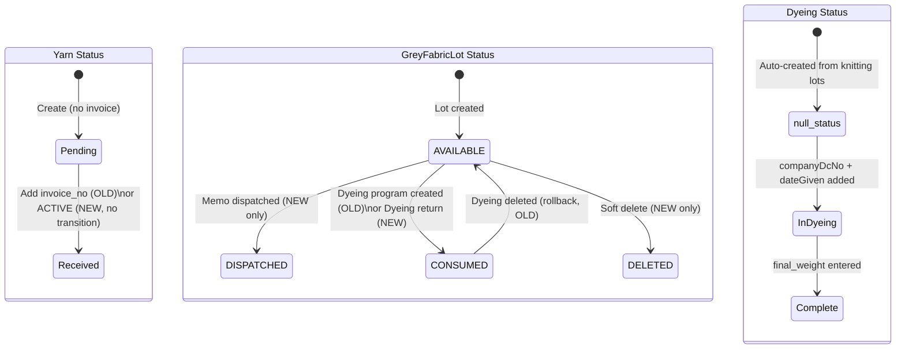

# Status Map — Fabric Flow Phase 0

> Generated: 2026-05-22 | Exact values extracted from source code

---

## 1. Yarn / YarnLot Statuses

### OLD (Yarn model — `backend/src/routes/yarn.js`)

| Status Value | Set When | Condition |
|-------------|----------|-----------|
| `'Pending'` | Yarn created with no invoice | `invoice_no === ''` |
| `'Received'` | Invoice number is present | `invoice_no && invoice_no.trim() !== ''` |

> Source: `yarn.js` line 115: `status: hasInvoice ? 'Received' : 'Pending'`

### NEW (YarnLot model — `schema.prisma`)

| Status Value | Set When | Notes |
|-------------|----------|-------|
| `'ACTIVE'` | Default on creation | `@default("ACTIVE")` |
| `'CLOSED'` | Manually or when depleted | Not yet auto-set in service |

> ⚠️ MISMATCH: Old uses `Pending`/`Received`. New uses `ACTIVE`/`CLOSED`. Different semantics.

---

## 2. Dyeing Statuses

### OLD (Dyeing model — `backend/src/routes/dyeing.js` + `knitting.js`)

| Status Value | Set When |
|-------------|----------|
| *(null / not set)* | When auto-created from Knitting lots |
| `'In Dyeing'` | Not explicitly set in old route handlers — **NOT FOUND in old code** |

> Note: Old system auto-created Dyeing records with no explicit status field.

### NEW (Dyeing model — `dyeings.service.ts`)

| Status Value | Set When | Condition |
|-------------|----------|-----------|
| `'In Dyeing'` | PATCH /dyeings/:id | `companyDcNo` is provided AND `(dateGiven || existing.dateGiven)` |
| *(null)* | Default on creation | No explicit default in schema |

> Source: `dyeings.service.ts` line 50-52:
> ```typescript
> if (dto.companyDcNo && (dto.dateGiven || existing.dateGiven)) {
>   data.status = 'In Dyeing';
> }
> ```

---

## 3. GreyFabricLot Statuses

### OLD (GreyFabricLot — `backend/prisma/schema.prisma` + `knitting.js`)

| Status Value | Set When |
|-------------|----------|
| `'AVAILABLE'` | Default when lot is created |
| `'CONSUMED'` | When `POST /api/dyeing/program` is called, `greyFabricLotId` is consumed |

> Source: `schema.prisma` line 262: `status String @default("AVAILABLE")`
> Source: `dyeing.js` line 151: `data: { status: 'CONSUMED' }`

### NEW (GreyFabricLotStatus enum — `schema.prisma`)

| Enum Value | Set When |
|------------|----------|
| `AVAILABLE` | Default |
| `DISPATCHED` | When memo is dispatched to dyer |
| `CONSUMED` | When dyeing return is recorded |
| `DELETED` | Soft delete |

> Source: `schema.prisma` lines 310-315:
> ```prisma
> enum GreyFabricLotStatus {
>   AVAILABLE
>   DISPATCHED
>   CONSUMED
>   DELETED
> }
> ```

---

## 4. DyeingProgram Statuses (NEW only)

| Status Value | Notes |
|-------------|-------|
| `'ACTIVE'` | Default: `@default("ACTIVE")` |

---

## 5. Status Transition Diagram



---

## 6. Module Visibility Rules by Status

| Module | Shows records when |
|--------|-------------------|
| **Yarn list** | All records always visible |
| **Dyeing list** | All records always visible |
| **Dyeing (OLD filter)** | No status filter — shows all |
| **Compacting** | Only after dyeing `lot_no` exists |
| **Grey Fabric Lots (OLD)** | Only `status = 'AVAILABLE'` in dropdown |
| **Grey Fabric Lots (NEW)** | By `status` enum filter |

---

## 7. Status Value Cross-Reference (OLD vs NEW)

| Entity | OLD Status Values | NEW Status Values | Match? |
|--------|-----------------|-----------------|--------|
| Yarn/YarnLot | `'Pending'`, `'Received'` | `'ACTIVE'`, `'CLOSED'` | ❌ No match |
| Dyeing | *(no status in old)* | `'In Dyeing'` | ⚠️ New only |
| GreyFabricLot | `'AVAILABLE'`, `'CONSUMED'` | `AVAILABLE`, `DISPATCHED`, `CONSUMED`, `DELETED` | ✅ Superset |
| DyeingProgram | N/A | `'ACTIVE'` | ✅ New only |

---

## 8. ⚠️ Critical Status Issues

1. **Yarn status mismatch** — Old frontend shows `Pending`/`Received` chips. New schema uses `ACTIVE`/`CLOSED`. Users accustomed to old UI will not recognise new statuses.

2. **No Dyeing status in old system** — The old system never set a `status` field on dyeing records. If new system requires `status = 'In Dyeing'` for visibility, records created without the transition will be invisible or broken.

3. **No status-based workflow gating** — Neither old nor new system enforces workflow stage gating based on status. Records at any stage can be created independently.
