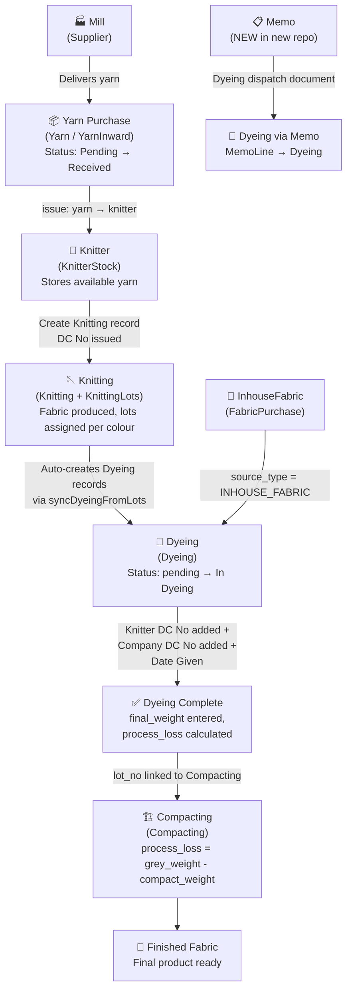
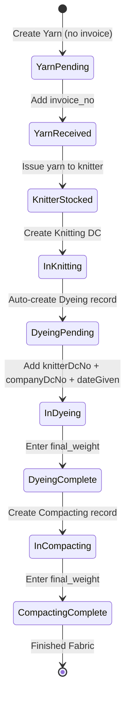

# Workflow Map — Fabric Flow Phase 0

> Generated: 2026-05-22 | Based on OLD repo source code analysis

---

## 1. End-to-End Workflow



---

## 2. Detailed Stage-by-Stage Workflow

### STAGE 1 — Yarn Purchase

**Old System (Yarn model):**

| Field | Description |
|-------|-------------|
| `hf_code` | HF batch code (auto-generated if empty: `HF-{timestamp}`) |
| `purchase_order_no` | PO number |
| `invoice_no` | Invoice number — KEY FIELD |
| `delivery_to` | Knitter name (text, not FK in old schema) |
| `mill_name_id` | FK to MillName |
| `no_of_bags` | Number of bags |
| `bag_weight` | Weight per bag (default: 60 kg) |
| `total_weight` | `no_of_bags × bag_weight` |
| `available_weight` | Initially = `total_weight`, decremented when issued |
| `rate_per_kg` | Price per kg |
| `total_cost` | `total_weight × rate_per_kg` |
| `status` | `'Pending'` (no invoice) OR `'Received'` (has invoice) |

**Status Rule (OLD):**
```
if invoice_no is present → status = 'Received'
else → status = 'Pending'
```

**New System (YarnLot + YarnInward models):**
- `YarnInward` = the physical receipt document
- `YarnLot` = the lot of yarn (linked to YarnInward)
- Extra fields: `cgstRate`, `sgstRate`, `cgstAmount`, `sgstAmount` (tax tracking)
- Status: `ACTIVE` / `CLOSED` (different from old `Pending` / `Received`)

---

### STAGE 2 — Yarn Issue to Knitter

**Trigger:** User clicks "Issue Yarn" button on Yarn page

**OLD Operation:** `POST /api/knitting/issue`
```
knitterId + yarnId + received_weight
→ yarn.available_weight -= received_weight
→ KnitterStock.received_weight += received_weight
→ KnitterStock.remaining_weight += received_weight
```

**NEW Operation:** `POST /yarn-lots/:id/issue`
```
knitterId + weight
→ yarnLot.availableWeight -= weight
→ KnitterStock upsert (receivedWeight, remainingWeight)
```

---

### STAGE 3 — Knitting (Knitter DC)

**Trigger:** User creates a Knitting record on the Knitting page

**Key fields:**
- `dc_no` — Unique DC number (enforced unique in DB)
- `knitter_name_id` — Which knitter
- `yarnUsages[]` — Which HF codes used and how much
- `lots[]` — KnittingLots per dyer (with colour entries)
- `grey_fabric_weight` — Estimated grey fabric weight
- `received_weight` — Actual weight received (optional at entry time)

**AUTO-CREATION:** When lots are saved → `syncDyeingFromLots()` runs:
```
For each lot entry (colour):
  → Creates a Dyeing record automatically
  → Sets initial_weight = entry.weight
  → Sets dyer_name_id = lot.dyer_name_id
  → Sets source_type = 'KNITTING'
```

**Balance recalculation:**
```
recalculateKnitterBalance(knitter_id):
  balance = Σ(total_yarn_qty) - Σ(received_weight)
  → updates KnitterName.yarn_balance
```

---

### STAGE 4 — Dyeing

**Dyeing records are created in TWO ways:**

#### Way 1 — Auto-created from Knitting lots (OLD standard flow)
```
Knitting → KnittingLot → KnittingLotEntry → Dyeing (auto-created)
```
Fields auto-populated:
- `hf_code` ← from Knitting.hf_code
- `lot_no` ← from KnittingLot.lot_no
- `initial_weight` ← from KnittingLotEntry.weight
- `dyer_name_id` ← from KnittingLot.dyer_name_id
- `colour_id` ← from KnittingLotEntry.colour_id
- `count` ← from Knitting.count
- `source_type` = `'KNITTING'`

#### Way 2 — Manual create from Dyeing page (old, for INHOUSE_FABRIC)
```
POST /api/dyeing
source_type = 'INHOUSE_FABRIC'
→ looks up InhouseKnittedFabric by fabric_code
→ auto-sets initial_weight = fabric.total_weight
```

#### Way 3 — Via GreyFabricLot (new program flow)
```
POST /api/dyeing/program
greyFabricLotId → lot.grey_weight → initial_weight
→ lot.status = 'CONSUMED'
source_type = 'GREY_FABRIC'
```

#### Way 4 — Via Memo (NEW in new repo)
```
Memo → MemoLine → Dyeing (linked via memoLineId)
```

**Status transition in Dyeing:**
```
User enters:
  knitterDcNo (knitter issues DC)
  + companyDcNo (company issues DC)
  + dateGiven
→ status = 'In Dyeing' (auto-set in new code)
```

**Process Loss (Dyeing):**
```
process_loss = ((initial_weight - final_weight) / initial_weight) × 100
```

---

### STAGE 5 — Compacting

**Trigger:** User creates Compacting record with a `lot_no` that must exist in Dyeing

**OLD Operation:**
```
POST /api/compacting
→ Validates lot_no exists in Dyeing table
→ Fetches dyeing.initial_weight as grey_fabric_weight
→ process_loss = ((grey_fabric_weight - final_weight) / grey_fabric_weight) × 100
```

> ⚠️ CRITICAL: Process loss uses **`dyeing.initial_weight`** (which IS the grey weight),
> NOT the `dyeing.final_weight` (dyed weight).
> Formula: `Grey Weight - Compact Weight`

**NEW Operation:**
- Compacting has `dyeingId` (FK to Dyeing)
- Process loss field exists but formula not yet verified

---

### STAGE 6 — Inhouse Fabric (Parallel Path)

```
FabricPurchase → InhouseKnittedFabric → Dyeing (source_type='INHOUSE_FABRIC')
```

This bypasses the Knitting stage entirely.

---

## 3. Status Transition Diagram



---

## 4. Document-Driven Transitions

| Document | Field | Module | Effect |
|----------|-------|--------|--------|
| Invoice No | `invoice_no` | Yarn | Status: `Pending` → `Received` |
| Knitter DC No | `dc_no` | Knitting | Creates Knitting record, triggers Dyeing auto-creation |
| Knitter DC No | `knitterDcNo` | Dyeing | Part of transition condition |
| Company DC No | `companyDcNo` | Dyeing | Status: → `In Dyeing` (when combined with dateGiven) |
| Date Given | `dateGiven` | Dyeing | Part of transition condition |
| Lot No | `lot_no` | Compacting | Links Compacting to Dyeing record |

---

## 5. Visibility Conditions

| Module | Record appears when |
|--------|-------------------|
| Yarn | Always visible in list |
| KnitterStock | After `issue` API call creates stock entry |
| Dyeing | Auto-created when Knitting lots are saved |
| Compacting | After manual creation with valid `lot_no` from Dyeing |
| Memo (new) | Manually created by user, triggers Dyeing via MemoLine |

---

## 6. NEW Repo — Memo Workflow (Added, Not in Old)

```
User creates Memo → selects Dyer → adds MemoLines
Each MemoLine = GreyFabricLot + sentWeight
Memo dispatch → grey fabric sent to dyer
→ MemoLine.dyeing (1:1) = Dyeing return record created when fabric comes back
```

This is a **NEW workflow** that does not exist in the old system.
The old system's dyeing was triggered directly from Knitting lots.
